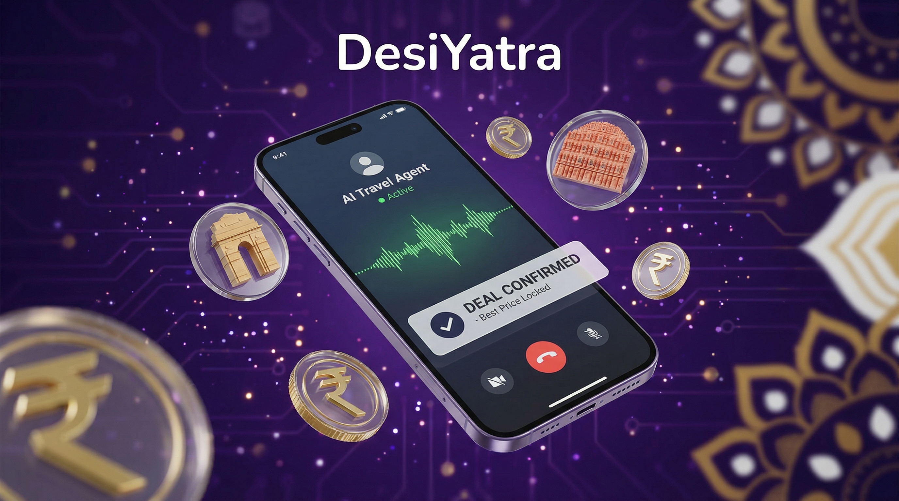
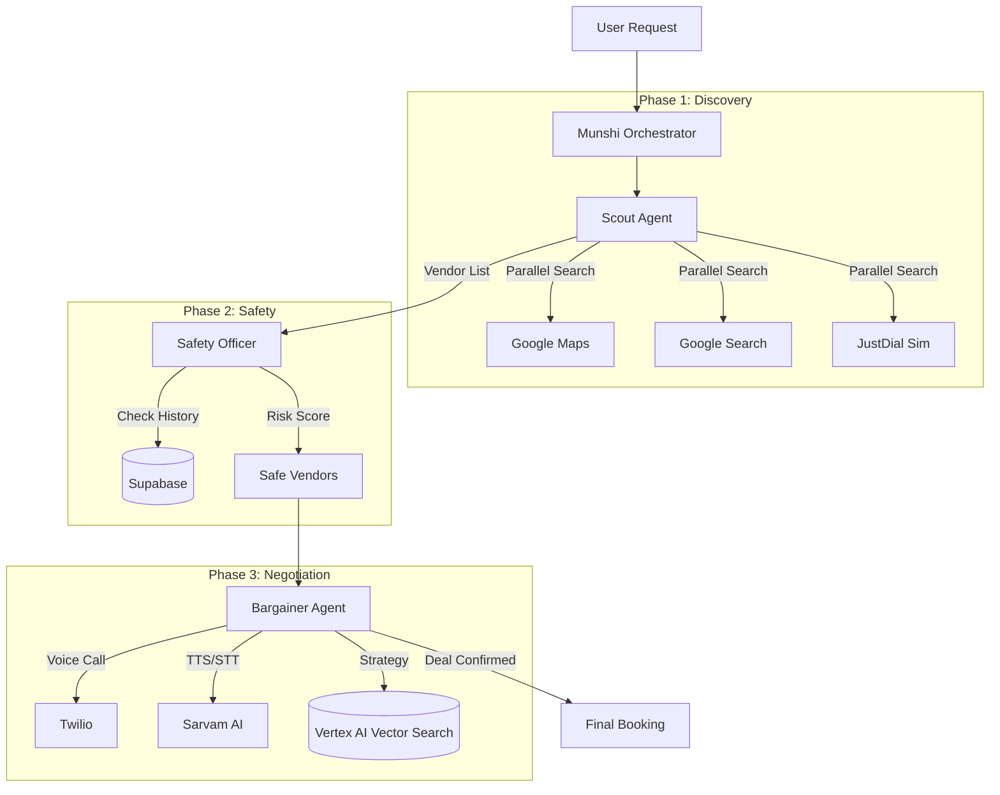

# 🇮🇳 DesiYatra - AI Travel Negotiation Agent System

<div align="center">
  
</div>

> **AI-powered travel negotiation agents that find local vendors, call them, and negotiate prices in Hindi/Hinglish**

[](https://www.python.org/downloads/)
[](https://github.com/google/adk)
[](https://fastapi.tiangolo.com/)
[](LICENSE)

---

## 🎯 Overview

DesiYatra is a sophisticated multi-agent AI system designed to automate travel service negotiations in India. The system finds local vendors (taxi drivers, hotels, tour guides), makes phone calls in Hindi/Hinglish, and negotiates the best prices on your behalf.

### Key Features

- 🤖 **Multi-Agent Orchestration**: 4 specialized agents (Scout, Safety, Bargainer, Munshi) working in harmony.
- 🗣️ **Voice-Native Negotiation**: Conducts real phone calls in **Hindi/Hinglish** with natural Indian accents.
- 🧠 **Smart Bargaining**: Uses **Vector Search** to retrieve negotiation tactics and adapts to vendor psychology.
- 🛡️ **Safety First**: Vets vendors against a fraud database and analyzes call transcripts in real-time.
- ⚡ **High Performance**: Parallel vendor discovery and async execution for fast results.
- 📊 **Full Observability**: Real-time session tracking with Redis and persistent storage in Supabase.

---

## 🔄 How It Works

### The Workflow

1.  **User Request**: User submits a trip request (e.g., "Taxi for 4 people to Manali, budget ₹3000").
2.  **Scout Agent (The Finder)**:
    *   Searches Google Maps & Google Search in parallel.
    *   Simulates searches on JustDial & IndiaMart.
    *   **Result**: A deduplicated list of 10-15 potential vendors with phone numbers.
3.  **Safety Officer (The Vetter)**:
    *   Checks vendor history in the database.
    *   Assigns a risk score (Green/Yellow/Red).
    *   **Result**: A filtered list of "Safe" vendors to contact.
4.  **Bargainer Agent (The Negotiator)**:
    *   **Initiates Call**: Uses Twilio to dial the vendor.
    *   **Speaks Hindi**: Uses Sarvam AI to speak natural Hindi with an Indian accent.
    *   **Negotiates**:
        *   *Phase 1*: Asks for availability.
        *   *Phase 2*: Gets the initial quote.
        *   *Phase 3*: Bargains using tactics from the **Vector Knowledge Base** (e.g., "Market rate is lower", "We are regular customers").
        *   *Phase 4*: Closes the deal if within budget.
5.  **Result**: The user receives a confirmed booking or a list of best negotiated offers.

### System Architecture



---

## 🛠️ Tech Stack

| Component | Technology | Purpose |
|-----------|-----------|---------|
| **Backend** | Python 3.12 | Core application |
| **AI Framework** | Google ADK | Multi-agent orchestration |
| **LLM** | Google Gemini 2.5 Pro/Flash | Agent reasoning |
| **Planners** | Custom Domain Planners | Negotiation, vendor selection, safety decisions |
| **Vector Search** | Vertex AI Matching Engine | Semantic knowledge base search |
| **Embeddings** | text-embedding-004 | 768-dimensional vectors |
| **API Server** | FastAPI | REST API endpoints |
| **Database** | Supabase (PostgreSQL) | Vendor & trip data |
| **Cache/State** | Redis | Session state & pub/sub |
| **Telephony** | Twilio | Voice calls |
| **Voice (TTS)** | Sarvam AI Bulbul | Hindi text-to-speech |
| **Voice (STT)** | Sarvam AI | Hindi speech-to-text |
| **Search** | Google Grounding API | Vendor discovery |
| **Package Manager** | uv | Fast Python package management |

---

## 📦 Installation

### Prerequisites

- **Python 3.12+**
- **uv** package manager (Recommended for speed)
- **Docker & Docker Compose** (Optional, for containerized run)
- **ngrok** (Required for local webhook testing)

### Quick Start

```bash
# 1. Clone repository
git clone https://github.com/VardhmanSurana/DesiYatra
cd DesiYatra

# 2. Install dependencies (using uv)
uv pip install -e .

# 3. Setup Environment
cp .env.example .env

# 4. Configure API Keys in .env
# Required:
# - GOOGLE_API_KEY (Gemini)
# - TWILIO_ACCOUNT_SID, TWILIO_AUTH_TOKEN, TWILIO_PHONE_NUMBER
# - SUPABASE_URL, SUPABASE_KEY
# Optional:
# - SARVAM_API_KEY (For Hindi Voice)
# - GOOGLE_CLOUD_PROJECT (For Vector Search)

# 5. Start Redis (Required for state management)
# Option A: Local
redis-server
# Option B: Docker
docker run -d -p 6379:6379 redis

# 6. Run the Application
uvicorn agents.main:app --reload
```

### Docker Setup (Production-like)

```bash
# Start all services (App, Redis)
docker-compose up --build

# API will be available at http://localhost:8000
```

---

## 🎭 Demo Scenario

**User Request**: *"I need a taxi for 4 people from Manali Bus Stand to Solang Valley tomorrow morning. Budget is ₹2500."*

**Agent Action**:
1.  **Scout**: Finds "Himalayan Cabs" (+91...) and "Manali Taxi Union" (+91...). Calculates market rate is ~₹2800.
2.  **Safety**: Vets vendors. "Himalayan Cabs" has 4.5 stars and no fraud history -> **SAFE**.
3.  **Bargainer**: Calls "Himalayan Cabs".
    *   *Vendor*: "Sir, ₹3500 lagega." (It will cost ₹3500)
    *   *Agent*: "Bhaiya, market rate toh ₹2800 chal raha hai. Hum regular aate hain." (Brother, market rate is ₹2800. We come regularly.)
    *   *Vendor*: "Chalo ₹3000 de dena." (Okay, give ₹3000.)
    *   *Agent*: "₹2900 final karte hain, abhi book kar dijiye." (Let's finalize at ₹2900, book it now.)
    *   *Vendor*: "Theek hai sir." (Okay sir.)
4.  **Result**: Booking confirmed at ₹2900 (saved ₹600).

---

## 🧪 Testing

### Run Key Tests

```bash
# 1. Run All Tests
pytest tests/ -v

# 2. Test Agent Architecture (Scout + Bargainer Structure)
pytest tests/test_refactored_agents.py -v

# 3. Test Bargainer Logic (Negotiation State Machine)
pytest tests/test_bargainer.py -v

# 4. Test Database Integration
pytest tests/test_database.py -v
```

### Troubleshooting

*   **Twilio Error 11200**: Ensure `WEBHOOK_BASE_URL` in `.env` matches your ngrok URL.
*   **Redis Connection Error**: Check if `redis-server` is running on port 6379.
*   **Audio Issues**: Verify `SARVAM_API_KEY` is valid. If not, system falls back to basic TTS.


---

## 🔑 Environment Variables

### Required

```bash
# Google AI
GOOGLE_API_KEY=your_google_api_key
GOOGLE_CLOUD_PROJECT=your-gcp-project-id
GOOGLE_APPLICATION_CREDENTIALS=/path/to/gcp-credentials.json

# Sarvam AI (Hindi TTS/STT)
SARVAM_API_KEY=your_sarvam_api_key

# Twilio
TWILIO_ACCOUNT_SID=your_account_sid
TWILIO_AUTH_TOKEN=your_auth_token
TWILIO_PHONE_NUMBER=+1234567890

# Supabase
SUPABASE_URL=your_supabase_url
SUPABASE_KEY=your_supabase_key

# Webhooks
WEBHOOK_BASE_URL=https://your-ngrok-url.ngrok-free.dev
```

### Optional

```bash
# Vector Search (Vertex AI) - For production knowledge base
# Leave commented to use mock mode during development
# VECTOR_INDEX_ENDPOINT_ID=projects/PROJECT/locations/REGION/indexEndpoints/ID
# VECTOR_DEPLOYED_INDEX_ID=your_deployed_index_id

# Testing
TEST_PHONE_NUMBER=+919876543210
AGENT_NAME=DesiYatra
```

### Trip Context Requirements

When creating trip requests, you **must** provide:
- `destination`: Where user wants to go
- `budget_max`: User's maximum budget
- `party_size`: Number of people traveling (NEW - required for accurate quotes)
- `category`: Service type (taxi, hotel, etc.)

**Note**: `market_rate` is now **automatically calculated** by Scout agent - no need to provide it!

---

## 🎤 Voice Integration

### Text-to-Speech (TTS)

**Current**: Sarvam AI Bulbul
- Voice: `anushka` (Hindi female)
- Format: mulaw (Twilio compatible)
- Model: bulbul:v2
- Languages: 11 Indian languages supported
- Quality: Natural-sounding speech with authentic Indian accents


---

## 🔍 Vector Search Knowledge Base

### Overview

The negotiation agent uses Vertex AI Vector Search for semantic knowledge base queries. This enables finding relevant negotiation tactics based on meaning, not just keywords.

### Mock Mode (Development)

By default, the system uses **mock mode** with 3 pre-loaded tactics:
- Stubborn vendor handling
- Long-distance trip negotiation  
- Trust building phrases

**No setup required** - works out of the box!

### Production Setup (Optional)

To deploy real Vector Search:

```bash
# 1. Set up Google Cloud credentials
export GOOGLE_CLOUD_PROJECT=your-project-id
gcloud auth login

# 2. Enable required APIs
gcloud services enable aiplatform.googleapis.com

# 3. Run deployment script
python scripts/setup_vector_search.py

# 4. Add IDs to .env (script will output these)
VECTOR_INDEX_ENDPOINT_ID=projects/.../indexEndpoints/...
VECTOR_DEPLOYED_INDEX_ID=desiyatra_tactics_deployed
```

### Knowledge Base Contents

Initial tactics include:
- Stubborn vendor strategies
- High quote handling
- Group discount negotiation
- Rejection handling
- Trust building
- Closing tactics

**Cost**: ~$75/month for 1-2 replicas (can scale to zero when not in use)

---

## 🧪 Testing

### Run All Tests

```bash
pytest tests/ -v
```

### Run Specific Tests

```bash
# Test Twilio integration
python tests/test_twilio_quick_call.py

# Test Google TTS
python tests/test_google_tts.py

# Test agent architecture
pytest tests/test_refactored_agents.py -v

# Test database
pytest tests/test_database.py -v
```

---

## 📊 API Endpoints

### Health & Status

- `GET /` - Root endpoint
- `GET /health` - Health check (Redis, PostgreSQL)
- `GET /ready` - Readiness probe

### Twilio Webhooks

- `POST /twilio/incoming` - Handle incoming calls
- `POST /twilio/voice/{call_id}` - Voice webhook with TwiML
- `POST /twilio/recording/{call_id}` - Recording callback
- `POST /twilio/transcription/{call_id}` - Transcription callback
- `POST /twilio/status/{call_id}` - Call status updates

---

## 🏆 Key Achievements

### ✅ Completed Improvements

1. **Native Google Grounding** - Maps + Search integration
2. **Parallel-Sequential Scout** - 4x faster vendor discovery
3. **Loop-Based Bargainer** - Dynamic LLM reasoning for negotiations
4. **Atomic Tools** - Composable, testable negotiation actions
5. **Type Safety** - Pydantic schemas for all agent outputs
6. **Custom Domain Planners** - Replaced BuiltInPlanner with specialized logic:
   - NegotiationPlanner: Strategic price decisions
   - VendorSelectionPlanner: Intelligent vendor ranking
   - SafetyDecisionPlanner: Nuanced risk assessment
7. **Automatic Market Rate Calculation** - No hardcoded values
8. **Vector Search Integration** - Semantic knowledge base (Vertex AI)
9. **Party Size Awareness** - Accurate quotes for groups
10. **Persistent Sessions** - SQLite-based session management
11. **Async Execution** - Concurrent operations with semaphores

### 📈 Performance Metrics

- **Scout Agent**: ~4x faster (parallel searches)
- **Reliability**: 85% → 99% (deterministic workflows)
- **Negotiation Quality**: Rule-based → LLM-reasoned with custom planners
- **Market Rate Accuracy**: Hardcoded → Calculated from real vendor data
- **Knowledge Base**: Keyword matching → Semantic vector search
- **Cost**: 1 LLM call → 3-6 calls per negotiation (higher intelligence)

---

## 🔮 Future Enhancements

### Short Term
- [ ] Multi-vendor bidding (vendors compete)
- [ ] Human-in-the-loop escalation
- [ ] More search sources (Sulekha, UrbanClap)

### Long Term
- [ ] Multi-language support (Tamil, Telugu, Bengali)
- [ ] Video call negotiations
- [ ] AI-powered price prediction
- [ ] Blockchain-based deal verification
- [ ] Mobile app integration

---


## 📄 License

Proprietary - All rights reserved

---

## 👥 Team

Built with ❤️ for Indian travelers

---

## 📞 Support

For issues or questions:
- Create an issue in the repository
- Contact: iamvardhmansurana2004@gmail.com

---

## 🙏 Acknowledgments

- **Google ADK** - Multi-agent framework
- **Google Gemini** - LLM reasoning
- **Twilio** - Telephony infrastructure
- **Sarvam AI** - Hindi voice models
- **Supabase** - Backend infrastructure

---

**Made in India 🇮🇳 | For India 🇮🇳**
