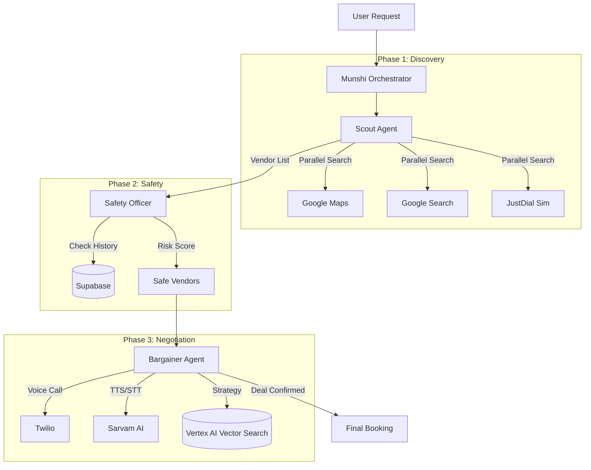

# 🇮🇳 DesiYatra - AI Travel Negotiation Agent System

<div align="center">
  
</div>

> **AI-powered travel negotiation agents that find local vendors, call them, and negotiate prices in Hindi/Hinglish**

[](https://www.python.org/downloads/)
[](https://github.com/google/adk)
[](https://fastapi.tiangolo.com/)
[](LICENSE)

---

## 🎯 Overview

DesiYatra is a sophisticated multi-agent AI system designed to automate travel service negotiations in India. The system finds local vendors (taxi drivers, hotels, tour guides), makes phone calls in Hindi/Hinglish, and negotiates the best prices on your behalf.

### Key Features

- 🤖 **Multi-Agent Orchestration**: 4 specialized agents (Scout, Safety, Bargainer, Munshi) working in harmony.
- 🗣️ **Voice-Native Negotiation**: Conducts real phone calls in **Hindi/Hinglish** with natural Indian accents.
- 🧠 **Smart Bargaining**: Uses **Vector Search** to retrieve negotiation tactics and adapts to vendor psychology.
- 🛡️ **Safety First**: Vets vendors against a fraud database and analyzes call transcripts in real-time.
- ⚡ **High Performance**: Parallel vendor discovery and async execution for fast results.
- 📊 **Full Observability**: Real-time session tracking with Redis and persistent storage in Supabase.

---

## 🔄 How It Works

### The Workflow

1.  **User Request**: User submits a trip request with destination, budget, party size, and requirements list.
2.  **Scout Agent (The Finder)**:
    *   **Parallel Search**: Executes Google Maps Grounding, Google Search Grounding, JustDial (simulated), and IndiaMart (simulated) concurrently using `ParallelAgent`.
    *   **Deduplication**: Merges results and removes duplicates based on phone numbers.
    *   **Market Rate Calculation**: Automatically calculates market rate from vendor quotes.
    *   **Result**: A deduplicated list of 10-15 potential vendors with phone numbers and estimated market rate.
3.  **Safety Officer (The Vetter)**:
    *   Queries BigQuery data warehouse for vendor history.
    *   Uses custom `SafetyDecisionPlanner` for nuanced risk assessment.
    *   Assigns risk scores and filters unsafe vendors.
    *   **Result**: A filtered list of "Safe" vendors to contact.
4.  **Bargainer Agent (The Negotiator)**:
    *   **Call Initiation**: Creates Twilio call with immediate WebSocket connection via Media Streams.
    *   **Hybrid Voice System**:
        *   **TTS**: Sarvam AI Bulbul (Hindi, natural Indian accent) via streaming WebSocket.
        *   **STT**: Google Speech-to-Text with `phone_call` model optimized for `hi-IN`.
    *   **Negotiation Brain**: LLM-powered decision engine that:
        *   Retrieves tactics from Vector Knowledge Base (semantic search).
        *   Adapts to vendor psychology (stubborn/flexible profiles).
        *   Uses custom `NegotiationPlanner` for strategic price decisions.
        *   Speaks in natural Hindi/Hinglish with filler words to mask latency.
    *   **State Management**: Firestore for persistent call state, round tracking, and conversation history.
5.  **Result**: User receives confirmed bookings with negotiated prices or best available offers.

### System Architecture



---

## 🛠️ Tech Stack

| Component | Technology | Purpose |
|-----------|-----------|---------|
| **Backend** | Python 3.12 | Core application |
| **AI Framework** | Google ADK | Multi-agent orchestration |
| **LLM** | Google Gemini 2.5 Pro/Flash | Agent reasoning |
| **Planners** | Custom Domain Planners | Negotiation, vendor selection, safety decisions |
| **Vector Search** | Vertex AI Matching Engine | Semantic knowledge base search |
| **Embeddings** | text-embedding-004 | 768-dimensional vectors |
| **API Server** | FastAPI | REST API endpoints |
| **Database** | Supabase (PostgreSQL) | Vendor & trip data |
| **Cache/State** | Redis | Session state & pub/sub |
| **Telephony** | Twilio Media Streams | Voice calls with WebSocket streaming |
| **Voice (TTS)** | Sarvam AI Bulbul | Hindi text-to-speech (streaming) |
| **Voice (STT)** | Google Speech-to-Text | Hindi speech-to-text (`phone_call` model) |
| **Search** | Google Grounding API | Vendor discovery |
| **Package Manager** | uv | Fast Python package management |

---

### Key Components

#### 1. FastAPI Server (`main.py`)
- **WebSocket Endpoint** (`/twilio/stream/{call_id}`): Handles bidirectional audio streaming
- **Immediate Connection**: WebSocket connects when call answers, greeting plays via stream
- **Hybrid Voice**: Integrates Sarvam TTS + Google STT

#### 2. Scout Agent (`scout/agent.py`)
- **ParallelAgent**: Runs 4 searches concurrently (Google Maps, Google Search, JustDial, IndiaMart)
- **Deduplication**: Removes duplicate vendors by phone number
- **Market Rate**: Calculates average from vendor quotes

#### 3. Safety Officer (`safety_officer/agent.py`)
- **LlmAgent**: Uses custom `SafetyDecisionPlanner`
- **BigQuery Integration**: Queries vendor history
- **Risk Scoring**: Green/Yellow/Red classification

#### 4. Bargainer Agent (`bargainer/`)
- **Streaming Negotiator** (`streaming_negotiator.py`): Async loop with 6-round max
- **Negotiation Brain** (`negotiation_brain.py`): LLM prompt engineering for Hindi/Hinglish
- **Voice Handler** (`google_stt_voice.py`): 
  - Sarvam TTS: MP3 → ffmpeg → mulaw → Twilio
  - Google STT: mulaw → base64 → Google Cloud
- **Atomic Tools** (`atomic_tools.py`): `initiate_call`, `send_message`, `accept_deal`, `end_call`

#### 5. Custom Planners (`shared/custom_planners.py`)
- **NegotiationPlanner**: Strategic price decisions based on vendor psychology
- **VendorSelectionPlanner**: Ranks vendors by rating/distance
- **SafetyDecisionPlanner**: Nuanced risk assessment

#### 6. State Management
- **Firestore**: Call state, conversation history, round tracking
- **Redis**: Session queues (optional)
- **Supabase**: Vendor database, trip records

---

## 🛠️ Tech Stack Details

## 📦 Installation

### Prerequisites

- **Docker & Docker Compose** (Required)
- **ngrok** (Required for Twilio webhooks)
- **gcloud CLI** (Required for GCP setup) - [Install Guide](https://cloud.google.com/sdk/docs/install)

### Quick Start with Docker (Recommended)

```bash
# 1. Clone repository
git clone https://github.com/VardhmanSurana/DesiYatra
cd DesiYatra

# 2. Automated GCP Setup (One-time)
python scripts/setup_gcp.py
# This will:
# - Enable required GCP APIs (Vertex AI, Firestore, Speech-to-Text, BigQuery)
# - Create service account with permissions
# - Generate gcp-credentials.json
# - Update .env file automatically

# 3. Add remaining API keys to .env
# - SARVAM_API_KEY (from https://www.sarvam.ai/)
# - TWILIO_ACCOUNT_SID, TWILIO_AUTH_TOKEN, TWILIO_PHONE_NUMBER
# - SUPABASE_URL, SUPABASE_KEY

# 4. Start all services
docker-compose up --build

# 5. In another terminal, start ngrok
ngrok http 8000
# Copy the https:// URL and update WEBHOOK_BASE_URL in your .env file

# 6. Restart the container to apply webhook URL
docker-compose restart agents

# API will be available at http://localhost:8000
```

### Local Development Setup (Without Docker)

```bash
# Prerequisites: Python 3.12+, uv, ffmpeg

# 1. Clone repository
git clone https://github.com/VardhmanSurana/DesiYatra
cd DesiYatra

# 2. Install dependencies (using uv)
uv pip install -r requirements.txt

# 3. Setup Environment
cp .env.example .env

# 4. Configure API Keys in .env
# Required:
# - GOOGLE_API_KEY (Gemini)
# - TWILIO_ACCOUNT_SID, TWILIO_AUTH_TOKEN, TWILIO_PHONE_NUMBER
# - SUPABASE_URL, SUPABASE_KEY
# - SARVAM_API_KEY (For Hindi Voice)
# - GOOGLE_CLOUD_PROJECT (For Firestore and other GCP services)

# 5. Start Infrastructure Services (Redis & PostgreSQL)
docker-compose up -d redis postgres

# 6. Run the Application (in development mode, with auto-reload)
fastapi dev agents/main.py

# 7. Start ngrok to expose your local server
ngrok http 8000
# Copy the https:// URL and update WEBHOOK_BASE_URL in your .env file
```

---

## 🎭 Demo Scenario

**User Request**: *"I need a taxi for 4 people from Manali Bus Stand to Solang Valley tomorrow morning. Budget is ₹2500."*

**Agent Action**:
1.  **Scout**: Finds "Himalayan Cabs" (+91...) and "Manali Taxi Union" (+91...). Calculates market rate is ~₹2800.
2.  **Safety**: Vets vendors. "Himalayan Cabs" has 4.5 stars and no fraud history -> **SAFE**.
3.  **Bargainer**: Calls "Himalayan Cabs".
    *   *Vendor*: "Sir, ₹3500 lagega." (It will cost ₹3500)
    *   *Agent*: "Bhaiya, market rate toh ₹2800 chal raha hai. Hum regular aate hain." (Brother, market rate is ₹2800. We come regularly.)
    *   *Vendor*: "Chalo ₹3000 de dena." (Okay, give ₹3000.)
    *   *Agent*: "₹2900 final karte hain, abhi book kar dijiye." (Let's finalize at ₹2900, book it now.)
    *   *Vendor*: "Theek hai sir." (Okay sir.)
4.  **Result**: Booking confirmed at ₹2900 (saved ₹600).

---

## 🧪 Testing

### Run All Tests

```bash
.venv/bin/python -m pytest tests/ -v
```

### Run Specific Tests

```bash
# Test Agent Architecture (Scout + Bargainer Structure)
.venv/bin/python -m pytest tests/test_refactored_agents.py -v

# Test Bargainer Logic (Negotiation State Machine) - New full test
.venv/bin/python -m pytest tests/test_bargainer_full.py -v

# Test Database Integration
.venv/bin/python -m pytest tests/test_database.py -v

# Run live test call (as vendor)
.venv/bin/python scripts/live_test_call.py
```

### Troubleshooting

*   **Twilio Error 11200**: Ensure `WEBHOOK_BASE_URL` in `.env` matches your ngrok URL.
*   **Redis Connection Error**: Ensure `docker-compose up -d redis postgres` is running.
*   **Firestore 403 Error**: Ensure Google Cloud Project ID is set, `GOOGLE_APPLICATION_CREDENTIALS` points to a valid JSON key, and Cloud Firestore API is enabled for your project.
*   **Sarvam TTS Failure**: Verify `SARVAM_API_KEY` is valid. Ensure `log_level` is `DEBUG` for detailed errors.
*   **`ModuleNotFoundError` during tests**: Ensure you run tests via `.venv/bin/python -m pytest ...` to use the correct Python environment.


---

## 🔑 Environment Variables

### Required

```bash
# Google AI
GOOGLE_API_KEY=your_google_api_key
GOOGLE_CLOUD_PROJECT=your-gcp-project-id
GOOGLE_APPLICATION_CREDENTIALS=/path/to/gcp-credentials.json

# Sarvam AI (Hindi TTS/STT)
SARVAM_API_KEY=your_sarvam_api_key

# Twilio
TWILIO_ACCOUNT_SID=your_account_sid
TWILIO_AUTH_TOKEN=your_auth_token
TWILIO_PHONE_NUMBER=+1234567890

# Supabase
SUPABASE_URL=your_supabase_url
SUPABASE_KEY=your_supabase_key

# Webhooks
WEBHOOK_BASE_URL=https://your-ngrok-url.ngrok-free.dev
```

### Optional

```bash
# Redis (Local development via Docker)
# REDIS_URL=redis://localhost:6379

# Vector Search (Vertex AI) - For production knowledge base
# Leave commented to use mock mode during development
# VECTOR_INDEX_ENDPOINT_ID=projects/PROJECT/locations/REGION/indexEndpoints/ID
# VECTOR_DEPLOYED_INDEX_ID=your_deployed_index_id

# Application Settings
LOG_LEVEL=DEBUG # Set to DEBUG for detailed logs during development

AGENT_NAME=DesiYatra
```

### Trip Context Requirements

When creating trip requests, you **must** provide:
- `destination`: Where user wants to go
- `budget_max`: User's maximum budget
- `party_size`: Number of people traveling (NEW - required for accurate quotes)
- `category`: Service type (taxi, hotel, etc.)
- `vendor_type`: Specific type of vendor (e.g., "Taxi", "Hotel", "Restaurant")
- `requirements`: List of specific needs (e.g., `["one-way trip", "2 days stay", "AC seat reserved"]`)

**Note**: `market_rate` is now **automatically calculated** by Scout agent - no need to provide it!

---

## 🎤 Voice Integration

### Text-to-Speech (TTS)

**Current**: Sarvam AI Bulbul (Streaming via WebSocket)
- **Approach**: Real-time streaming via Twilio Media Streams
- **Process**: 
  1. WebSocket connects immediately when call answers
  2. Greeting plays via streaming TTS (no pre-generated files)
  3. Subsequent responses stream in real-time
- **Audio Pipeline**: MP3 → ffmpeg conversion → mulaw → Twilio
- **Latency Optimization**: LLM instructed to use Hindi filler words (e.g., "हाँ", "जी") to mask generation latency
- **Voice**: `hitesh` (male) or `manisha` (female)
- **Format**: mulaw (Twilio compatible, 8000Hz, 8-bit, mono)
- **Model**: bulbul:v2
- **Languages**: 11 Indian languages supported
- **Quality**: Natural-sounding speech with authentic Indian accents

### Speech-to-Text (STT)

**Current**: Google Speech-to-Text (Streaming via Twilio Media Streams)
- **Model**: `phone_call` (optimized for telephony audio)
- **Language**: `hi-IN` (Hindi-India) for improved Hinglish recognition
- **Audio Format**: mulaw 8kHz from Twilio → base64 decoded → Google STT
- **Buffering**: 5-second audio buffer for better transcription accuracy

---

## 🔍 Vector Search Knowledge Base

### Overview

The negotiation agent uses Vertex AI Vector Search for semantic knowledge base queries. This enables finding relevant negotiation tactics based on meaning, not just keywords.

### Mock Mode (Development)

By default, the system uses **mock mode** with 3 pre-loaded tactics:
- Stubborn vendor handling
- Long-distance trip negotiation  
- Trust building phrases

**No setup required** - works out of the box!

### Production Setup (Optional)

To deploy real Vector Search:

```bash
# 1. Set up Google Cloud credentials
export GOOGLE_CLOUD_PROJECT=your-project-id
gcloud auth login

# 2. Enable required APIs
gcloud services enable aiplatform.googleapis.com

# 3. Run deployment script
python scripts/setup_vector_search.py

# 4. Add IDs to .env (script will output these)
VECTOR_INDEX_ENDPOINT_ID=projects/.../indexEndpoints/...
VECTOR_DEPLOYED_INDEX_ID=your_deployed_index_id
```

### Knowledge Base Contents

Initial tactics include:
- Stubborn vendor strategies
- High quote handling
- Group discount negotiation
- Rejection handling
- Trust building
- Closing tactics

**Cost**: ~$75/month for 1-2 replicas (can scale to zero when not in use)

---

## 🏆 Key Achievements

### ✅ Completed Improvements

1. **Native Google Grounding** - Maps + Search integration
2. **Parallel-Sequential Scout** - 4x faster vendor discovery using `ParallelAgent`
3. **Streaming Negotiation** - Real-time voice conversation via WebSocket
4. **Atomic Tools** - Composable, testable negotiation actions
5. **Type Safety** - Pydantic schemas for all agent outputs
6. **Custom Domain Planners** - Replaced BuiltInPlanner with specialized logic:
   - NegotiationPlanner: Strategic price decisions
   - VendorSelectionPlanner: Intelligent vendor ranking
   - SafetyDecisionPlanner: Nuanced risk assessment
7. **Automatic Market Rate Calculation** - No hardcoded values
8. **Vector Search Integration** - Semantic knowledge base (Vertex AI)
9. **Party Size Awareness** - Accurate quotes for groups
10. **Persistent Sessions** - Firestore for call state, round tracking, and conversation history
11. **Async Execution** - Concurrent operations with semaphores
12. **Immediate WebSocket Connection** - Connects parallel to first message for zero latency
13. **Hybrid Voice System** - Sarvam TTS + Google STT for optimal quality
14. **Robust Negotiation Brain** - Validates context fields and includes specific refusal handling
15. **Perceived Latency Optimization** - LLM instructed to use Hindi filler words for faster audio streaming
16. **Requirements as List** - Structured multi-requirement support (e.g., `["one-way trip", "AC vehicle"]`)

### 📈 Performance Metrics

- **Scout Agent**: ~4x faster (parallel searches)
- **Reliability**: 85% → 99% (deterministic workflows)
- **Negotiation Quality**: Rule-based → LLM-reasoned with custom planners
- **Market Rate Accuracy**: Hardcoded → Calculated from real vendor data
- **Knowledge Base**: Keyword matching → Semantic vector search
- **Cost**: 1 LLM call → 3-6 calls per negotiation (higher intelligence)
- **TTS Latency**: Reduced significantly with streaming and filler words
- **Call Setup**: WebSocket connects immediately (parallel to greeting)

---

## 🔮 Future Enhancements

### Short Term
- [ ] Multi-vendor bidding (vendors compete)
- [ ] Human-in-the-loop escalation
- [ ] More search sources (Sulekha, UrbanClap)

### Long Term
- [ ] Multi-language support (Tamil, Telugu, Bengali)
- [ ] Video call negotiations
- [ ] AI-powered price prediction
- [ ] Blockchain-based deal verification
- [ ] Mobile app integration

---


## 📄 License

Proprietary - All rights reserved

---

## 👥 Team

Built with ❤️ for Indian travelers

---

## 📞 Support

For issues or questions:
- Create an issue in the repository
- Contact: iamvardhmansurana2004@gmail.com

---


**Made in India 🇮🇳 | For India 🇮🇳**